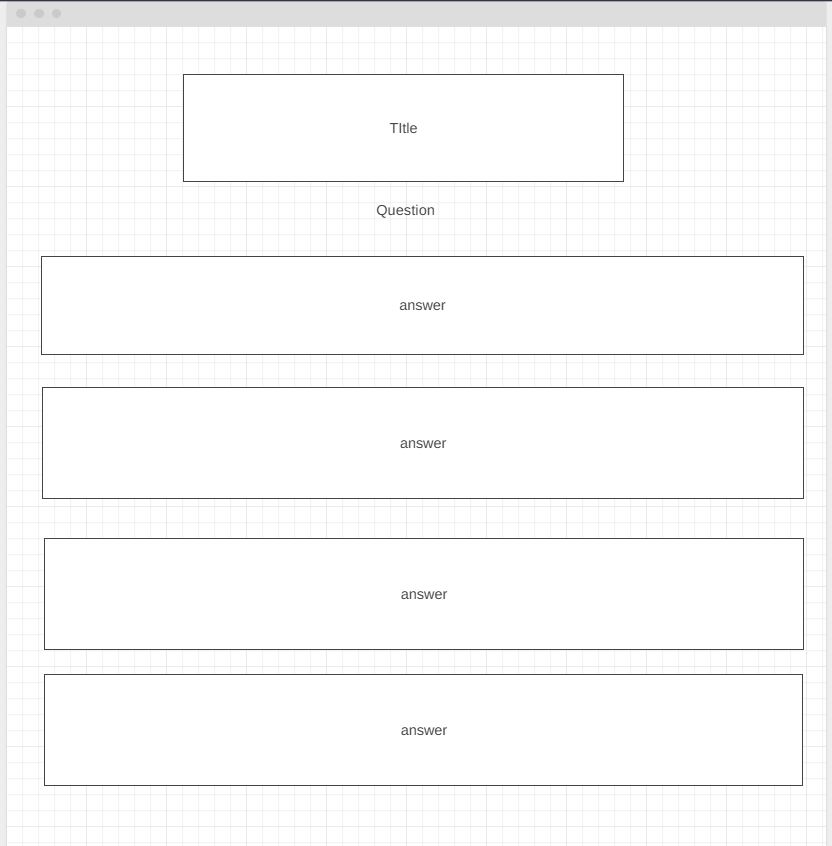

# Gotta Catch Them All! -  Testing

Visit the deployed site: [Gotta Test Them All!](https://github.com/Wazza1999/Project2-Quiz)

- - -

## CONTENTS

* [AUTOMATED TESTING](#automated-testing)
  * [W3C Validator](#w3c-validator)
  * [JavaScript Validator](#javascript-validator)
  * [Lighthouse](#lighthouse)
* [MANUAL TESTING](#manual-testing)
  * [Testing User Stories](#testing-user-stories)
  * [Full Testing](#full-testing)

Testing was ongoing throughout the entire build. I utilised Chrome developer tools whilst building to pinpoint and troubleshoot any issues as I went along.

During development I made use of google developer tools to ensure everything was working correctly and to assist with troubleshooting when things were not working as expected.

I utilised the console in the developer tools to work through small sections of JavaScript and ensure that the code was working, and also to troubleshoot where issues were.

I have gone through each page using google chrome developer tools & Firefox inspector tool to ensure that each page is responsive on a variety of different screen sizes and devices.

- - -

## AUTOMATED TESTING

### W3C Validator

[W3C](https://validator.w3.org/) was used to validate the HTML on all pages of the website. It was also used to validate the CSS.

* [index.html](testing/w3c/htmlvalidation.jpg) - Passed.

* [style.css](testing/w3c/cssvalidation.jpg) - Passed, no errors found.

- - -

### JavaScript Validator

[jshint](https://jshint.com/) was used to validate the JavaScript.

* [javascript.js](testing/w3c/jshint.jpg) - Passed
- - -

### Lighthouse

I used Lighthouse within the Chrome Developer Tools to test the performance, accessibility, best practices and SEO of the website.

### Desktop Results

All pages of the site are achieving a score of 100 in accessibility and best practices, performance, SEO categories.

### Mobile Results

Each page is achieving a score of 100 for the last three categories. The performance category is achieving a score of 98 for the first three pages and a score of 99 on the 404 & 500 page.

- - -

### Full Testing

Full testing was performed on the following devices:

* Laptop:
  * Macbook Pro 2021 14 inch screen
* Mobile Devices:
  * iPhone 13 pro.
  * iPhone 11 pro.
  * Phone X.

Each device tested the site using Google chrome

Additional testing was taken by friends and family on a variety of devices and screen sizes. They reported no issues when playing.

One tester in peer code review stated that the bottom of the play screen was cut off when testing on an iphone SE (2nd gen). I was unable to replicate this issue using google chrome developer tools.

`Main Page`

| Feature | Expected Outcome | Testing Performed | Result | Pass/Fail |
| --- | --- | --- | --- | --- |
| The Sites title | Link directs the user back to the home page | Clicked title | Home page reloads | Pass |
| Answer buttons| The answer buttons should turn green or red respectively when selected to correspond with the right and wrong answer| Clicked button | buttons colours change | Pass |
| All buttons - hover effect | All buttons should turn dark goldenrod when hovering over with the cursor | Hover over each button on the page | Each button displayed the correct styling when hovered over | Pass |

`End of Quiz`

| Feature | Expected Outcome | Testing Performed | Result | Pass/Fail |
| --- | --- | --- | --- | --- |
| The Sites title | Link directs the user back to the home page | User clicks on quiz answers again | Quiz starts again | Pass |
| All buttons - hover effect | All buttons change to the colour dark goldenrod when hovering over with the cursor | Hover over each button on the page | Each button displayed the correct styling when hovered over | Pass |
